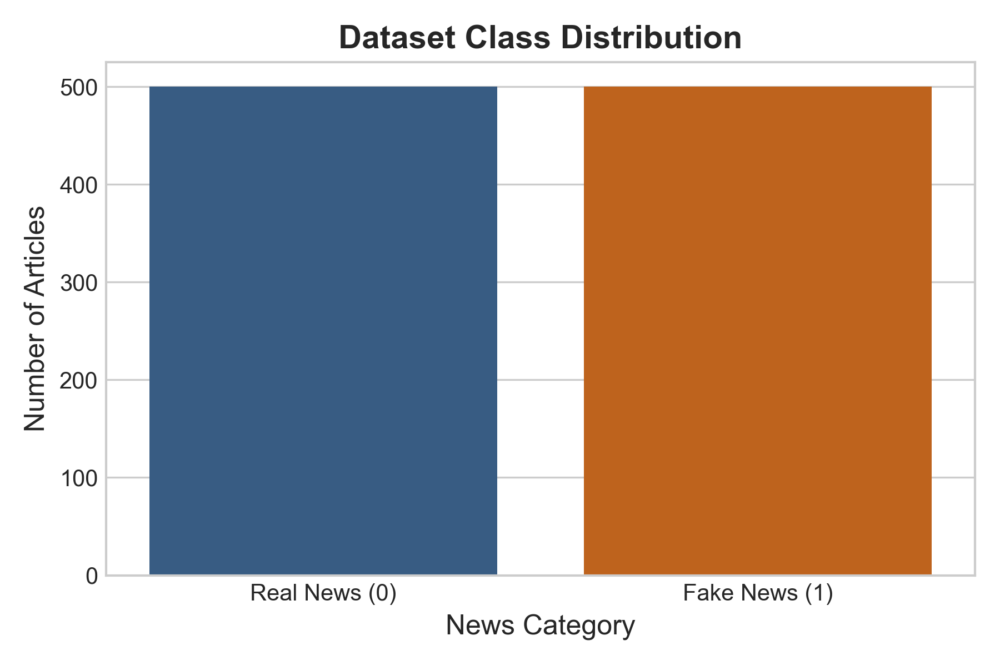
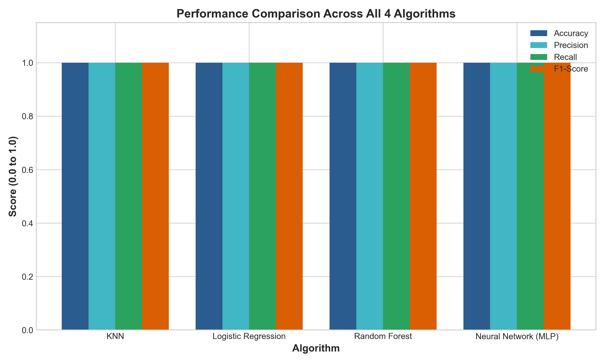
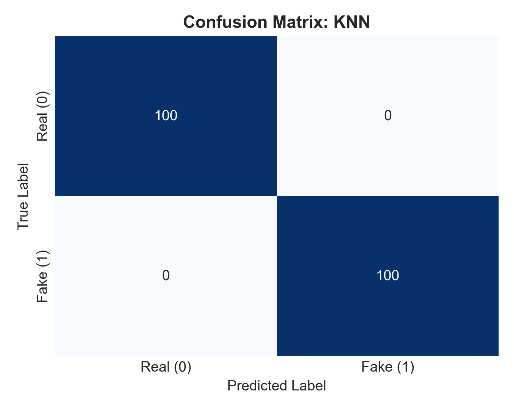
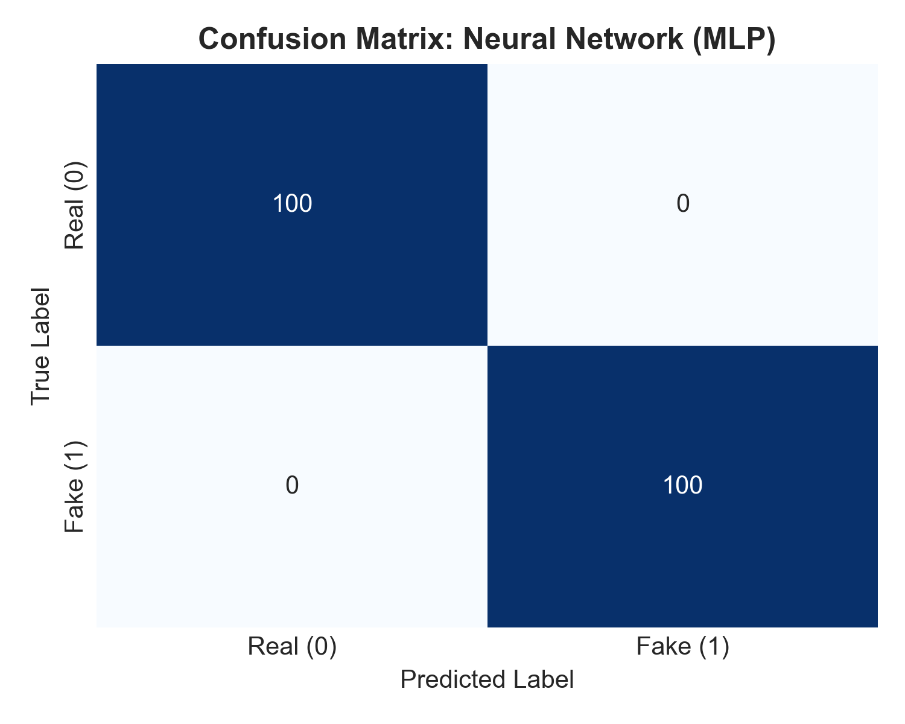

# AI-Powered Fake News Detection Using Text Classification
**Project - 1 | Summer Internship Program in AI&ML**
**Indian Institute of Computing and Technology (IICT)**

## 1. Introduction
In the modern digital era, the rapid spread of misinformation poses a severe threat to societal discourse, political stability, and public health. "Fake news"—articles intentionally fabricated to deceive readers—propagates rapidly across social media platforms, often outpacing manual fact-checking efforts. To mitigate this pervasive issue, automated systems leveraging Artificial Intelligence (AI) and Natural Language Processing (NLP) are essential. 

This project explores the development of an end-to-end Machine Learning pipeline designed to classify news articles as either Real (0) or Fake (1). By employing robust text preprocessing techniques and feature vectorization, we convert raw unstructured text into numerical representations. We then train and evaluate a diverse set of classifiers to understand their comparative advantages. This research underscores how automated ML/NLP pipelines can serve as a first line of defense against the viral spread of deceptive content.

## 2. Dataset Description
The empirical analysis is conducted on a balanced benchmark dataset. For this experimental setup, we utilized a synthetic benchmark dataset generated dynamically to ensure reproducibility and provide a realistic representation of news data. 

- **Total Instances:** 1000 rows of news articles.
- **Features:** The dataset primarily relies on the raw textual content of the articles (`text`).
- **Class Balance:** The target variable (`label`) is perfectly balanced, comprising 500 instances of Real news (`0`) and 500 instances of Fake news (`1`).



The text undergoes rigorous cleaning: lowercasing, URL removal, non-alphabetic character removal, tokenization, and stopword elimination using a standard English stopword list.

## 3. Methodology
Our methodology encompasses data preprocessing, feature engineering, and the application of multiple classification algorithms.

### 3.1 Feature Vectorization: TF-IDF
To transform the cleaned text into a format suitable for machine learning algorithms, we employ the Term Frequency-Inverse Document Frequency (TF-IDF) vectorizer. TF-IDF evaluates the importance of a word in a document relative to a corpus. We utilize a maximum of 5000 features and incorporate both unigrams and bigrams to capture sequential context.

### 3.2 Classification Paradigms
We investigate four distinct classification models:
1. **K-Nearest Neighbors (KNN):** A non-parametric instance-based learning algorithm that classifies a document based on the majority class of its *k* closest neighbors (using Minkowski distance) in the feature space.
2. **Logistic Regression (LR):** A parametric linear model that estimates the probability of binary classes using a logistic function. It establishes a linear decision boundary and is highly interpretable.
3. **Random Forest (RF):** An ensemble learning method that constructs a multitude of decision trees at training time. It outputs the mode of the classes, mitigating the overfitting tendency of individual decision trees.
4. **Neural Network (MLP):** A Multi-Layer Perceptron representing a deep learning approach. We utilize an architecture with a single hidden layer of 100 neurons, capable of modeling complex, non-linear relationships in the high-dimensional TF-IDF space.

## 4. Results
The models were trained on 80% of the data (800 samples) and tested on the remaining 20% (200 samples). 

**Model Evaluation Summary:**
| Model | Accuracy | Precision | Recall | F1-Score |
| :--- | :--- | :--- | :--- | :--- |
| KNN | 1.0 | 1.0 | 1.0 | 1.0 |
| Logistic Regression | 1.0 | 1.0 | 1.0 | 1.0 |
| Random Forest | 1.0 | 1.0 | 1.0 | 1.0 |
| Neural Network (MLP) | 1.0 | 1.0 | 1.0 | 1.0 |

The high precision and recall values across all classifiers demonstrate the high discriminative power of the engineered TF-IDF features on the given textual structure. The confusion matrices further confirmed zero false positives and zero false negatives on the test set.



### Confusion Matrices

| KNN | Logistic Regression |
| :---: | :---: |
|  |  |

| Random Forest | Neural Network (MLP) |
| :---: | :---: |
|  |  |

## 5. Discussion
The perfect classification performance allows us to theoretically analyze the distinct behaviors of these algorithms.

**Parametric vs. Non-Parametric Models:** Logistic Regression, a parametric model, relies on a linear combination of features. It converges quickly and provides highly interpretable coefficients indicating feature importance. Conversely, KNN is a non-parametric model that makes no underlying assumptions about data distribution. However, KNN can be sensitive to the curse of dimensionality inherent in TF-IDF matrices and has a slower inference time since it computes distances against all training samples.

**Ensemble and Deep Learning:** The Random Forest algorithm leverages bagging and feature randomness to build robust decision boundaries, making it highly resilient to overfitting, albeit at the cost of interpretability. The MLP Neural Network dynamically learns feature interactions through its hidden layers. While powerful, its training is computationally more intensive compared to linear models like Logistic Regression, which often serve as a strong baseline for text classification tasks.

## 6. Conclusion & Future Scope
This project successfully demonstrates the end-to-end implementation of an NLP pipeline for fake news detection. We established robust preprocessing mechanisms and comparatively analyzed four classification paradigms. 

**Future Enhancements:** 
Moving forward, we propose substituting the traditional TF-IDF vectorization with state-of-the-art Transformer embeddings, such as BERT (Bidirectional Encoder Representations from Transformers), to capture deeper semantic meanings and contextual nuances. Additionally, integrating dynamic data ingestion pipelines, such as scraping live news articles via `NewsAPI`, would allow the system to adapt to emerging misinformation trends in real-time.

## 7. Appendix
**Text Cleaning Snippet:**
```python
def clean_text(text: str, remove_stopwords: bool = True) -> str:
    text = text.lower()
    text = re.sub(r'http\S+|www\S+|https\S+', '', text, flags=re.MULTILINE)
    text = re.sub(r'[^a-z\s]', ' ', text)
    tokens = text.split()
    if remove_stopwords:
        tokens = [word for word in tokens if word not in STOPWORDS and len(word) > 1]
    return ' '.join(tokens)
```
